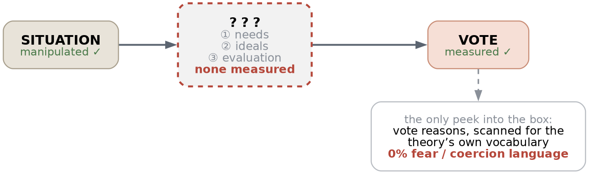

% Prestige vs. Dominance in Simulated Teams
% agent-sim / pd_matched
% Weekly report, 2026-08-25

# The theory we start from

- Dual Strategies Theory: two routes to leadership
- **Prestige** — influence via freely conferred respect
- **Dominance** — influence via fear and coercion
- Known finding: threat shifts preference toward dominance
- Replicated across large cross-national datasets

::: notes

**這個研究領域在講什麼**

演化心理學有一個「雙路徑模型」（Dual Strategies Theory），主張人類取得領導地位有兩條互相獨立的路：

- **Prestige（聲望）**：別人「自願」把影響力給你，因為你有真本事、願意分享知識。權力來自別人的尊敬。
- **Dominance（支配）**：你「主動奪取」影響力，靠掌控議程、讓反對你的代價變高。權力來自別人的忌憚。

這兩條路不是「好領導 vs 壞領導」，而是兩種在不同環境下各有優勢的策略。原始文獻是 Henrich & Gil-White (2001) 和 Cheng et al. (2013)。

**已經被反覆證實的效果**

「威脅會讓人偏好支配型領袖」這件事本身已經有很強的證據。Kakkar & Sivanathan (2017, *PNAS*) 用超過 14 萬名受試者、69 個國家、跨越二十年的資料，發現經濟不確定性（貧窮率、失業率、房屋空置率）會提升民眾對支配型領袖的支持。

**所以我們不是在重新發現這個效果**——這點很重要，下一頁講為什麼。

:::

# What the theory does not explain

- The top-line effect is well established
- But *why* threat shifts preference is under-specified
- "Fear and coercion" is a definition, not a mechanism
- What changes inside the follower when threat appears?
- Leadership is studied from the leader's side

::: notes

**這一頁是整個研究的起點，最重要**

「威脅 → 偏好支配型」這個效果很穩固，但**理論對「為什麼」的說明很薄弱**。

**問題一：機制沒有被指名**

雙路徑模型說支配型的影響力來自「恐懼與強制」。但這是一個**定義**，不是一個機制。它沒有回答：威脅出現時，追隨者**內心發生了什麼改變**，導致他們突然覺得支配型的人比較適合當領導？

可能的答案有好幾種，而且互相不同：
- 追隨者變得需要「保護」，而支配型看起來能提供保護
- 追隨者只是想要有人「快點做決定」，跟保護無關
- 追隨者想搭上強者的順風車，提升自己的地位

這三種說法會做出不同的預測，但目前的理論沒有區分它們。

**問題二：整個領域偏重領導者那一側**

領導學研究長期以來大多在問「什麼樣的人會成為領導者」「領導者該有什麼特質」。**追隨者被當成被動的評分機器**——他們的需求是什麼、這些需求怎麼隨情境變動，很少被系統性地測量。

這正是 FFNI 這篇論文要補的洞，下一頁。

:::

# The FFNI: measuring the follower side

- Sheng, Andrews & van Vugt (2026), *J. Applied Psychology*
- Fundamental Follower Needs Inventory — 22 items
- Six needs people want a leader to satisfy
- Turns "what followers want" into a measurable variable
- Validated across five studies

::: notes

**這篇論文做了什麼**

Sheng, X., Andrews, W., & van Vugt, M. (2026). The psychology of following: Conceptualizing and validating the Fundamental Follower Needs Inventory. *Journal of Applied Psychology*, 111(6), 768–801.

它把「追隨者到底想從領導者身上得到什麼」變成一個**可以測量的東西**。做法是開發並驗證一份 22 題的量表，稱為 **FFNI（基本追隨者需求量表）**，把追隨者的需求拆成六個獨立的維度。

**為什麼這對我們重要**

因為它提供了前一頁缺的那個機制變項。如果我們能測量「追隨者當下的需求」，就能問：威脅是不是**透過改變需求**才改變了領導偏好？這就從「威脅 → 偏好支配」變成「威脅 → 需求改變 → 偏好支配」，中間多了一個可以驗證的環節。

**授權注意事項**（實務上會踩到）：FFNI 的題目是 CC BY-NC-ND 4.0 授權。NoDerivatives 表示**不能改寫、刪減或翻譯**題目——逐字整份使用是允許的，我們的 `instruments/ffni.json` 就是完整 22 題逐字收錄（取自論文 Table 4）。但**不能只抽出其中幾題當成一份獨立的短量表**，那算刪減。這個限制在後面設計威脅感受度檢核題時會再遇到一次。

:::

# The six follower needs

| Need | What the follower wants |
|---|---|
| Protection | someone who stands between us and a threat |
| Status | someone who raises our standing |
| Affiliation | someone who builds group belonging |
| Vision | someone who sets a clear direction |
| Expertise | someone we can learn from |
| Fairness | someone who runs a fair process |

::: notes

**六個需求，逐一解釋**

每個需求都有 3–4 個題目，7 點量表作答。以下是各分量表的代表題（逐字取自論文 Table 4）：

- **Protection（保護）**：「我希望有一個能擋在我的團體和外部威脅之間的領導者。」「我願意追隨一個會為我對抗外人的領導者。」
- **Status（地位）**：「我需要一個能提升我地位的領導者。」「我希望有一個能讓我們團體獲得地位的領導者。」
- **Affiliation（歸屬）**：「我希望有一個能營造良好團體氣氛的領導者。」
- **Vision（願景）**：「我希望有一個能設定明確目標的領導者。」
- **Expertise（專業）**：「我需要一個能讓我向他學習的領導者。」
- **Fairness（公正）**：「我需要一個能確保程序沒有偏誤的領導者。」

**跟雙路徑模型怎麼對上**

這是關鍵的接合點。六個需求可以按照 Cheng et al. (2013) 的雙路徑分成兩側：

- **支配側**：Protection、Status——都跟「對抗外部、爭奪位階」有關
- **聲望側**：Affiliation、Vision、Expertise、Fairness——都跟「能力、信任、公平」有關

所以理論預測就變得很具體：**威脅應該會拉高 Protection 和 Status 這兩個需求**，而這兩個需求正好指向支配型領袖。這就是可以檢驗的中介機制。

:::

# Four layers, and what measures each

::: notes

**這張圖是整份報告的骨架，後面每一頁都掛在它上面**

論文把「追隨者怎麼看領導者」拆成三層，我們的實驗再往下接一層（投票）。四層的差別在於**問句指向誰**——程式裡 instrument 檔案的 `about` 欄位就是在記這件事。

**① 需求（NEEDS）— `about: self`**
問「我」。我想從領導者身上得到什麼。用 FFNI，22 題，7 點量表。
**這一層是情境前後各測一次**（baseline 和 post），因為 H3 要看的是同一個人的需求**怎麼被情境改變**。其他三層都只在情境後測。

**② 原型（IDEALS）— `about: prototype`**
問「領導者這個類別」。一般而言什麼樣的人算是領導者。用 12 個形容詞，10 點量表。指示語明確講「不是這場會議裡的任何人」——這一層刻意不指涉任何具體對象。

**③ 評價（EVALUATION）— `about: each_candidate`**
問「這個人」。對剛才真的觀察過的每一位參與者各評一次，7 點量表單題。

**④ 投票（VOTE）**
**注意投票不是論文的三層之一**，它是我們實驗的行為結果，在三層的下游。

**③ 和 ④ 的差別很關鍵**：
- 第三層是**絕對評分**，每個人獨立打分，互不影響——你可以給兩個人都打 6 分。
- 投票是**強迫選擇**，只能選一個，是零和的。

所以兩者會分離。你可能覺得 P 和 D 都很稱職（評分都高），但被迫選一個時選了 D。這個分離本身就是資料：如果評分差不多但投票一面倒，代表決定投票的因素不在評分裡。

**而本週的 pd_matched 只測了第 ④ 層**，前三層一個都沒測——這就是它有結果卻沒有機制的原因。

:::

# The layers do not have to agree

- Each layer has its own instrument and its own target
- You can want protection in the abstract...
- ...and still rate a protective person poorly
- That mismatch is where the paper's results break
- It is also where our vote-reason finding lands

::: notes

**第②層的完整對應表**

論文把每個需求對應到它預測的領導者原型形容詞，這 12 個字就是 `leader_ideal` 量表的全部內容（10 點量表，評「這個特質有多符合領導者」）：

| 需求 | 對應原型形容詞 | 雙路徑歸屬 |
|---|---|---|
| protection | strong, tough | 支配側 |
| status | domineering, power-hungry | 支配側 |
| affiliation | compassionate, friendly | 聲望側 |
| vision | charismatic, courageous | 聲望側 |
| expertise | educated, intelligent | 聲望側 |
| fairness | honest, ethical | 聲望側 |

**注意這不是標準的 ILT 量表**。Offermann & Coats 的內隱領導理論量表有 51 題，我們沒有用。這裡用的是**論文自己的需求對原型的對應**，因為 H4 要檢驗的就是這個一對一的對應關係。代價是分數不能跟已發表的 ILT 常模比較。

**為什麼三層不一定一致——這是重點**

你可能在抽象層說「領導者就是要強悍」，但真的遇到一個強悍的人時卻給他低分。抽象的理想和具體的評價是兩回事，而且**它們用的是不同的心理歷程**：原型是從記憶裡調出來的刻板印象，評價是對眼前這個人的即時判斷。

下一頁的圖就是論文自己在這裡撞到的牆。

:::

# Where their own results broke down

::: notes

**這張圖是整個研究能切入的縫隙，最重要的一張**（內容已對照原文 PDF 核實）

兩條路徑並排：上排聲望側，下排支配側。

**下排第二段斷掉**——這是他們論文 p.42 的原話：

> "Contrary to expectations, the FFNs for protection and status **failed to predict** perceived effectiveness of dominance-based leadership styles (e.g., Authoritarianism, Narcissism, Dominance), despite their established relationships with dominance-based implicit leadership theories... this **intriguing discrepancy** suggested that while FFNs for protection and status may influence leadership **prototypes**, they did **not necessarily translate to effectiveness perceptions**."

**但這裡有一個關鍵細節，比原本以為的更有利於我們**

他們的第③層**不是在評價真人**。Study 5 的作法是：Time 1 填 FFNI，**一週後**的 Time 2 給受試者看**大約 50 條抽象的領導者描述**，問「如果這些人是你的領導者，你覺得多有效」。受試者從頭到尾**沒有觀察過任何人**。

所以他們的②和③其實**都是抽象的**——②是形容詞（「領導者該是什麼樣子」），③是描述句（「這種領導者有多有效」）。兩者之間的距離比我原先畫的小很多。

**真正的空白在最右邊**：讓受試者**真的看著一個人主導一場有壓力的會議，然後評價那個人**——這件事**兩側都沒有人做過**。不是支配側失敗、聲望側成功，而是整個「真人」欄位是空的。

**這就是我們的位置**。我們的 agent 是真的坐在那場會議裡，看著 D 打斷別人、關掉討論、逕自決定，然後才評分和投票。如果在這種條件下支配側那條線變綠，那是新發現；如果依然是紅的，那就是在遠比問卷嚴苛的條件下複製了他們的斷裂——兩種結果都有價值。

**注意這跟我們的投票理由掃描是同一件事的兩面**：0% 恐懼語言 = 支配型拿到了支持，但支持它的理由從來不是理論說的那個理由。

:::

# Their design vs ours

| | Sheng et al. | Ours |
|---|---|---|
| Threat | measured | **manipulated** |
| Target rated | ~50 descriptions | **a person just observed** |
| Needs | once, or 1 week apart | **before and after** |
| Outcome | ratings | ratings **+ a vote** |

::: notes

**這張表把前面兩頁的差異收攏成四行**

**第一行 — 威脅**：他們是**測量**個體差異（誰比較容易感到威脅），我們是**操弄**情境（同一批人格，兩種情境）。這是相關性設計和實驗設計的差別，也是他們 Limitations 第三點自己指出的缺陷。

**第二行 — 評價對象**：他們給的是約 50 條抽象的領導者描述句，受試者沒見過任何人。我們是評價一個剛剛一起開了三輪會的具體對象。**這是最大的差異**，也是「真人」那一欄從來沒被填過的原因。

**第三行 — 需求的測量時機**：他們在 Study 5 是 Time 1 測 FFNI、一週後 Time 2 測效能評價，中間沒有任何事件。我們是同一場情境的**前後測**，中間夾著操弄，所以可以看到需求**被情境改變**的量。

**第四行 — 結果變項**：他們只有評分（知覺層次）。我們有評分**加上一場強迫選擇的投票**（行為層次）——正是他們 Limitations 第四點說該做但沒做的。

**要誠實補一句**：我們的「真人」是 LLM 扮演的，不是真人。這一欄贏得沒有那麼乾淨。但相對於「讀 50 條描述句」，經歷一場實際互動仍然是明顯不同的心理歷程。

:::

# Four gaps the authors name themselves

- **Mediation** — do needs carry the context → endorsement effect?
- **Moderation** — does conflict strengthen protection → dominance?
- **Manipulation** — "vignettes or **simulations** of threat"
- **Behaviour** — go beyond ratings to "**voting**, leader support"
- Their own design was self-report, correlational, one week apart

::: notes

**四個空白，全部是作者自己在論文裡寫出來的**（已逐句對照 PDF 原文）

我原本以為是兩個，讀完發現是四個，而且我們的設計四個都打到。

**① 中介（p.45–46，Directions for Future Research）**

> "...prior research has shown that **intergroup conflict increases preference for dominant leaders** (Laustsen & Petersen, 2017; Spisak et al., 2012)... these studies **often assume yet do not empirically test the mediating role of follower needs**—likely due to a lack of validated measures."

他們明講：這個效果大家都知道，但沒人測過需求是不是中間那一環，因為以前沒有經過驗證的量表。FFNI 補上了工具，但他們自己沒做這個實驗。

**② 調節（p.42，緊接在 Study 5 的斷裂之後）**

> "would **inter-group conflict situations** (e.g., trade wars, organizational crises) **strengthen the FFN protection-authoritarianism link**?"

這句話幾乎就是我們 H7 的原文。

**③ 操弄方法（p.49，Limitations 第三點）**

> "our research relied **entirely on self-report measures and correlational designs**, limiting causal inference... Future studies should use experimental manipulations (e.g., vignettes or **simulations** of threat, inequality, or uncertainty)..."

他們自己寫了「simulations」。我們做的正好是這個。

**④ 行為結果（p.45–46 與 p.49，Limitations 第四點）**

> "we focused primarily on **cognitive and perceptual outcomes**... rather than **behavioral consequences**... Future research should also go beyond cognitive and perceptual outcomes to examine behavioral consequences of follower needs, such as **voting in elections**, leader support, resistance, or insubordination."

我們的依變項就是一場投票。這是他們點名要但沒有的東西。

**他們自己的設計限制（對照用）**：全部線上問卷（Prolific、Credamo）、自陳量表、相關性設計、Time 1 到 Time 2 隔一週。沒有操弄、沒有互動、沒有行為結果。

:::

# Our plan, in two steps

- **Step 1 (done this week)** — establish the behavioural effect
- Clean personas, no confounds, adequately powered
- **Step 2 (next)** — add the FFNI and test the mechanism
- Step 1 first: a mechanism for an unstable effect is worthless
- Step 1 is `pd_matched`, Step 2 is `ffni_mediation`

::: notes

**為什麼分兩步，而不是直接做有趣的那個**

直覺上會想直接去做中介分析——那才是新的、有貢獻的部分。但這樣做有風險。

**中介分析的前提是那個效果本身是穩的。** 如果「威脅 → 支配型獲勝」在我們的模擬裡根本不成立，或是成立但其實是被人格差異汙染的假象，那再精緻的中介模型都只是在解釋一個不存在的東西。而且中介分析比主效果更需要樣本數和乾淨的變異來源。

**所以先做 Step 1**：把效果本身建立起來，而且要建立在**沒有混淆變項**的基礎上。這就是本週的 `pd_matched`——它沒有測任何機制，它唯一的工作是證明「在這個模擬環境裡，威脅確實會讓支配型勝出，而且那不是人格或職業造成的假象」。

**Step 2 是 `ffni_mediation`**：在同樣的架構上加掛三份量表（FFNI、leader_ideal、effectiveness），去測前一頁那兩個未解問題。

接下來的投影片是 Step 1 的細節和結果，最後再回到 Step 2 的規劃。

:::

# What Step 1 can and cannot see

::: notes

**這張圖說明本週工作的位置和它的天花板**

**兩端都有資料**：左邊的情境是我們操弄的，右邊的投票是我們測量的。所以「威脅會讓支配型勝出」這個因果宣稱，Step 1 可以支持。

**中間全是黑箱**：前面講的三層——需求、原型、評價——**一層都沒測**。所以任何「為什麼」的問題，Step 1 原理上都答不出來。

**唯一的一次窺探（右邊那條虛線）**：投票理由的文字掃描。這是想從既有資料裡逆推機制，成本是零（理由本來就存著）。但結果是 0% 的恐懼／強制語言——它只能告訴我們「他們沒說什麼」，推不出「他們心裡在運作什麼」。

**為什麼這不算失敗**：Step 1 的設計目標就只是把行為效果建立乾淨。刻意不加量表，是因為每加一份量表就多一批 API 呼叫和一批可能出錯的地方，而在效果本身還沒確立之前，那些成本是浪費的。黑箱是預期中的，不是疏漏。

**但它確實劃出了 Step 2 的必要性**：要打開這個黑箱，只能真的把量表放進去測。

:::

# Step 1 hypotheses

- **H1** — Collaborative: Prestige gets more votes
- **H2** — Threat: Dominance gets more votes
- **Interaction** — the D−P gap is larger under threat
- The interaction is the primary test
- Two separate one-sided tests prove no difference

::: notes

**兩個情境（condition）**

同一批 persona 會跑兩種不同的開會情境：

- **Collaborative（合作）**：團隊連續兩季沒達成目標，高層授權這個小組自行診斷原因並提出一個具體改變。要達成所有人都願意執行的共識。有摩擦設定（過去嘗試過但半途而廢，成員對原因和責任歸屬看法不同）。
- **Threat（威脅）**：資源被威脅的情境，部門面臨裁撤壓力。

兩個情境用的是**完全相同的 persona**，只有情境描述不同。

**三個假設**

- **H1**：合作情境下，聲望型應該贏（大家有餘裕欣賞真本事）。
- **H2**：威脅情境下，支配型應該贏（危機時大家想要有人立刻做決定）。
- **交互作用（Interaction）**：威脅情境下的「D 減 P 票差」，應該比合作情境下的票差**更大**。

**為什麼交互作用才是主要檢定（最容易搞錯的地方）**

假設我分別做兩個檢定，發現「合作情境 P 顯著贏」而且「威脅情境 D 顯著贏」。看起來很完美，但這**在統計上不構成「兩個情境有差異」的證據**。這是統計學上一個有名的錯誤（difference of significance ≠ significance of difference）——兩個檢定各自跨過門檻，不代表它們彼此之間的差距是顯著的。

要證明「威脅造成了偏好轉向」，必須直接檢定「票差本身」在兩個情境之間有沒有差異。這就是交互作用檢定。這也是為什麼後面 H1 沒過但交互作用有過，結論依然成立。

:::

# How one run works

- 10 agents: 1 Prestige, 1 Dominance, 8 Neutral
- Three rounds of open discussion on the scenario
- Then everyone votes for who should lead
- Each vote carries a one-sentence reason
- 20 runs per condition, personas rotate

::: notes

**一場模擬長什麼樣**

**組成**：每場 10 個 agent。從 6 個聲望型裡抽 1 個、6 個支配型裡抽 1 個，加上 8 個固定的中立成員（N）。中立成員是「有能力但不爭取領導」的角色，他們是主要的投票者。

**流程**：
1. 所有 agent 讀到同一個情境描述
2. 開放討論三輪，每輪每個 agent 可以發言
3. 討論結束後，每個 agent 投票給「誰該領導這個團隊」，不能投自己
4. 投票時同時要寫一句話說明理由

**投票提示語的一個修正**（本週改的）：原本問的是「你**最信任**誰來領導」。但「信任」正是聲望在雙路徑模型裡的核心貨幣——用這個字問，等於在題目裡就偏袒了聲望側，H2 還沒開始就先輸一半。改成中性的「誰**應該**領導這個團隊」。因為當時還沒有任何資料，這個修改沒有成本。

**中立成員為什麼固定 8 人**：原本有 24 個中立成員輪流抽 8 個，本週改成固定 8 人。輪替的觀眾會增加場次之間的變異，在只有 20 場的情況下會吃掉檢定力。固定下來的代價是結論變成「以這 8 個人為條件」的，但對 pilot 來說這個取捨是對的。

**輪數為什麼是 3**：因為配對出來的 P1 和 D1 必然人格相同，可能兩個都是低外向性的人。輪數太少的話，安靜的領導候選人可能整場都沒講幾句話，投票者就沒有印象可以評。這個風險後面有專門的檢查機制。

:::

# The old sampling problem

- P and D groups were drawn at random from the bank
- Random assignment at n = 6 leaves large trait gaps
- No amount of extra uniformity fixes it
- Rerandomising balances only what you search on
- Measured by simulating 2000 seeds

::: notes

**背景：什麼是 persona bank**

我們有一個 3645 筆的 persona 資料庫（`personas_output.json`），結構是 243 種五大人格組合 × 15 種職業，每種組合剛好一筆，是完美的全因子設計。要跑實驗時就從裡面抽人出來當 P 組和 D 組。

**原本的作法和它的問題**

原本是**隨機抽**：隨機抽 6 個人當聲望組，再隨機抽 6 個當支配組。

問題在於 **n = 6 太小**。隨機分派要能讓兩組「平均起來差不多」，靠的是大數法則，但 6 個人根本不夠。結果就是兩組在五大人格上常常差很多——而人格差異本身就會影響誰被選為領導者（例如外向的人講比較多話、比較容易被記得）。這樣一來，你就分不清票數差距是「支配策略」造成的，還是「剛好比較外向」造成的。這種混進來、無法區分的變項叫做**混淆變項（confound）**。

**兩個常見的誤解，這頁在澄清**

- 「是不是抽樣不夠均勻？」不是。原本的抽樣已經是均勻的了（每個人格組合抽一個，職業在組合內也是均勻的）。問題出在 n = 6 這個數字本身，跟抽樣方法無關。
- 「那我多試幾個亂數種子，挑一個平衡的不就好了？」這叫 **rerandomisation（重新隨機化）**，可以做，但它只會平衡「你拿去篩選的那個變項」。你篩人格，職業就會爆掉。

最後一行說明這些不是憑感覺講的，是實際模擬 2000 個亂數種子測出來的，數字在下一頁。

:::

# Random assignment, 2000 seeds

| Quantity | Value |
|---|---|
| Median max Big Five gap | 2.0 |
| Worst seed | 5.0 |
| Seeds reaching gap ≤ 0.5 | 0.9% |
| Seeds with unequal parent counts | 50% |

::: notes

**這張表怎麼讀**

把舊的隨機抽樣流程重跑 2000 次（每次換一個亂數種子 seed），每次都抽 6 人一組，然後量兩組差多少。

**Median max Big Five gap = 2.0**
「max gap」的意思是：五大人格有五個維度（開放性、盡責性、外向性、親和性、神經質），每個維度算出 P 組平均和 D 組平均的差距，取**其中最大的那一個**。取最大是因為只要有任何一個維度差太多，實驗就毀了。
2000 個種子的中位數是 **2.0 分**（量表是 0–10）。也就是說**一半以上的情況**，兩組在某個人格維度上就差了 2 分，大到足以自己解釋掉投票結果。

**Worst seed = 5.0**
最糟的種子差到 5 分，是整個量表的一半。抽到這種而不自知，實驗數據就是廢的——而隨機抽樣不會告訴你抽到了什麼。

**Seeds reaching gap ≤ 0.5 = 0.9%**
如果要求「兩組人格要夠接近」（差距 ≤ 0.5 分），2000 個種子裡只有大約 18 個過得了關。這就是為什麼用 rerandomisation 硬找很沒效率。

**Seeds with unequal parent counts = 50%**
關鍵的轉折。就算辛苦找到人格平衡的種子，**另一半的種子在「是否為父母」上兩組人數不對等**。而每多要求平衡一個變項，需要的種子數就是相乘的（0.9% × 50%），很快就不可行。

**真實案例**：先前的 `ffni_profiles` 研究就是這樣掛掉的。它用 rerandomisation 把人格差距壓到 0.5 以內（seed 30），但沒有把職業納入搜尋條件，結果 6 個支配型 persona 裡有 **3 個是全職家長**，而聲望組是 0 個——偏偏情境是「部門要被裁撤」。這個研究本週被整個刪掉了。

:::

# The fix: paired sampling

- `tools/pair_bank.py` builds P_i and D_i from one bank row
- Identical by construction:
    - Big Five traits
    - Occupation
    - Age group and parental status
- Verified gap = 0 at every seed
- Asserted at the end of every run

::: notes

**解法：不要隨機，改用配對**

既然隨機分派在 n = 6 時必然失敗，那就不要隨機。

**作法**：從 bank 抽出 6 筆資料，每一筆**同時生出一個 P 和一個 D**。P1 和 D1 來自同一列，P2 和 D2 來自同一列，以此類推。兩人的五大人格、職業、年齡層、是否為父母**完全相同**，唯一的差別是套上去的影響力策略文字（`STYLE_BLOCKS` 裡的 P 版或 D 版）。

**"Identical by construction" 是什麼意思**

「依構造相同」——不是「測量後發現剛好差不多」，而是**在建構方式上就不可能不同**。這比統計上的平衡強得多：統計平衡是機率問題，構造相同是邏輯問題。

所以「gap = 0 at every seed」不是跑了很多種子後的實測結果，而是**數學上必然**。程式碼在每次執行結束時會用 `assert` 驗證這件事，如果哪天有人改壞了會立刻炸掉，不會靜悄悄地產生髒資料。

**風格文字也是統一的**：P 和 D 的影響力描述是**每個人都一樣**的固定文字，不是讓 LLM 各自生成。這樣「操弄」本身是一個常數，只有人格在變，不會有六個各自不同、沒人測量過的版本。

**可能被問到的問題**：P 和 D 職業相同（例如兩個都是藥師），在同一場會議裡會不會很奇怪？不會影響——agent 看不到彼此的 persona 檔案，只能看到對方在會議中說的話。

:::

# Power, simulated over 3000 reps

| r | D votes | P votes | Power at 20 runs |
|---|---|---|---|
| 1.0 | 1.03 | 1.00 | 4% |
| 1.5 | 1.38 | 0.97 | 36% |
| 2.0 | 1.83 | 0.90 | 78% |

::: notes

**什麼是檢定力（statistical power）**

檢定力 = 「如果效果真的存在，我這個實驗有多大機率能偵測到它」。檢定力 50% 就等於丟銅板——效果明明存在，你有一半機率會漏掉。慣例上要求 80% 以上。

這件事必須**在跑實驗之前算**，否則跑完得到不顯著的結果時，你無法區分「真的沒效果」和「有效果但我的實驗看不到」。

**模擬怎麼做的（`tools/power_sim.py`）**

一場 run 有 10 個 agent（1 個 P、1 個 D、8 個中立 N），每人投一票、不能投自己。把 D 的「吸票權重」設成 *r*，其他所有人都是 1，然後按權重隨機抽籤。

**所以 *r* 就是效應量**：*r* = 2 表示「D 的吸引力是別人的兩倍」，*r* = 1 表示「D 跟別人沒兩樣」也就是虛無假設。跑 3000 次重複，看有多少比例達到 p < 0.05。

**逐列解讀**

- **r = 1.0 → 4%**：這列是**虛無假設**，D 和 P 一樣吸引人。所以這 4% 不是檢定力，是**偽陽性率**（明明沒效果卻誤判為有效果的機率）。它應該落在 5% 附近，實際是 4%，代表這個統計檢定沒有失控。這是驗證模擬本身寫對了的健全性檢查。
- **r = 1.5 → 36%**：就算 D 真的有 1.5 倍吸引力，跑 20 runs 也有 **64% 的機率測不出來**。
- **r = 2.0 → 78%**：接近 80% 的慣例門檻。

**結論**：20 runs 只能偵測到 *r* ≥ 2 的**大效果**，也就是 D 要拿到大約 P 兩倍的票。

**這個模擬的限制**：它是加權隨機抽籤，不是在模擬「經過討論後的判斷」。它能給出虛無分布和「效應量 → 檢定力」的對應，這對決定樣本數就夠了，但它假設票數變異純粹來自抽籤。等累積夠多真實資料後，應該改成從真實紀錄重抽樣。程式碼裡標了註解。

:::

# What the power sim decided

- *r* is D's relative pull on votes; *r* = 1 is the null
- 20 runs resolves only a large effect
- The interaction beats either condition alone
- 54% vs 36% power at *r* = 1.5
- So 20 runs is a **pilot**, not a confirmatory test
- Confirmatory n comes from the observed *r*

::: notes

**這個模擬導出的兩個決定**

**決定一：交互作用檢定的檢定力比單一情境更高**

這點反直覺。一般會以為交互作用是「更複雜的檢定」所以更難達標，但在 *r* = 1.5 時它有 **54%** 檢定力，單一情境只有 36%。

原因：合作情境的效果**方向相反**（聲望領先）。所以當你比較「威脅的票差」和「合作的票差」時，兩個方向相反的效果會把差距**拉得更開**，比單獨看威脅情境更容易偵測。

這很好，因為交互作用本來就是唯一真正對應「威脅造成轉向」這個宣稱的檢定。理論上該做的檢定，剛好也是統計上比較有力的——不需要在兩者之間取捨。

**決定二：把 20 runs 定位成 pilot（先導研究），不是驗證性檢定**

既然 20 runs 只能看到大效果，那它的正確用途是**估計效應量**，而不是宣稱「有沒有顯著」。

**為什麼這個定位很重要**：如果我把 20 runs 當成正式檢定，跑出 p = 0.06 覺得「差一點」就再加 20 runs 跑到顯著為止——這叫 **optional stopping（隨意停止）**，會大幅膨脹偽陽性率。事先宣告「這是 pilot，用來估效應量」，正式研究的樣本數再從觀察到的 *r* 去算，就避開了這個問題。

:::

# A manipulation check was added

- Three items asking how threatened the agent feels
- Mentions no leader and no person — cannot prime the vote
- Post-scenario only, and only the Neutral agents
- Without it, a null result is uninterpretable
- Costs about 20% more API calls per run

::: notes

**為什麼需要操縱檢核（manipulation check）**

假設威脅情境跑出來沒有效果。這時候有兩種完全不同的解釋：

1. 威脅**真的不會**改變領導偏好（理論錯了，或至少在這個環境裡不成立）
2. 我們寫的那個情境**根本沒讓 agent 覺得受威脅**（操弄失敗，跟理論無關）

沒有操縱檢核就無法區分這兩者，等於整個虛無結果都無法解讀。

**設計上的三個決定**

- **不提到任何領導者或人**：只問「你覺得目前處境有多大威脅」這類的自我感受。如果題目裡提到領導，就可能反過來影響後面的投票（叫做 priming）。
- **只在情境後施測，不做事前基線**：因為我們要看的是**兩個情境之間的差異**。如果做事前測量，量到的會是「這個 persona 天生多容易感到威脅」這種特質，不是情境效果。
- **只問中立成員（N）**：他們是投票者，他們的感受才是相關的。

**為什麼不直接用 FFNI 的保護分量表**（三個理由，由強到弱）

我們手上其實**有**完整的 FFNI 22 題，保護分量表的 4 題就在裡面。但它不適合當這裡的操縱檢核：

1. **測的東西不對**。FFNI 保護分量表問的是「我**想要**一個保護我的領導者」——那是一個**需求**。操縱檢核要問的是「我**現在覺得**有多受威脅」——那是一個**狀態**。兩者不同。
2. **會造成循環論證**。更嚴重的是，「保護需求」正是 Step 2 的 H6 要檢驗的**中介變項**。拿中介變項本身當操縱檢核，等於用結論去驗證前提。
3. **每一題都提到領導者**。例如「我希望有一個能擋在我的團體和外部威脅之間的領導者」。操縱檢核的設計原則是不能提到任何領導者或人，否則會影響後面的投票。
4. （授權層面）就算前三點都不成立，只抽出 4 題當獨立短量表也算刪減，ND 不允許。

所以自己寫了 3 題：「我在這裡的位置感覺不穩固」「這個情況很緊急，沒有多少時間可以把它做對」「如果這件事出錯，對我個人的後果會很嚴重」——只講處境和自身感受，完全不提領導。

**結果**：威脅情境 5.38，合作情境 3.21，而且 20 場的平均值跟先前小規模試跑的數字差在 0.1 以內。操弄是穩定的，不是小樣本的僥倖。

:::

# A speech-rate check was added

- Paired P and D are necessarily the same personality
- So both can be low-extraversion in the same run
- A near-silent candidate gives voters nothing to judge
- `run.py validate` cannot catch this
- Report now flags anyone speaking in ≤ 1/3 of turns

::: notes

**配對設計帶來的一個新風險**

配對讓 P1 和 D1 人格完全相同——這是優點，但也意味著**兩個人可能同時都是低外向性**。低外向性的 persona 在會議裡可能很少發言。

如果一場模擬裡的領導候選人幾乎沒講話，投票者就沒有任何印象可以評判，那一場的投票基本上是雜訊。6 個配對中每一對大約會出現在 20 場中的 3.3 場，所以估計**約 30% 的場次**可能踩到這個問題。

**為什麼既有工具抓不到**

`run.py validate` 這個檢查功能只看「每場都出現的組別」（也就是中立成員 N），因為它的邏輯是判斷 `sample is None` 的組別。而 P 和 D 是每場抽樣的，剛好落在它的盲區。

**本週補的東西**

`summarize_contrast` 現在會回傳每個被對比 persona 的發言率，`render_contrast` 把它印出來，並對任何「發言率 ≤ 1/3」的人標警告。這樣如果哪一場的候選人太安靜，報告會直接講出來，而不是靜悄悄地混進統計裡。

（順帶一提，這跟前面 Bug 1 有關聯：`nationality` 那個 bug 造成的症狀正是「agent 幾乎不發言」，如果當時已經有這個檢查，會更快被抓到。）

:::

# Bug 1: silent crash every turn

- Personas built from the bank had no `nationality`
- TinyTroupe's `minibio()` indexes that key each turn
- No fallback, so it raised `KeyError`
- The catch-all logged it as a plain silent turn
- Looked like two bugs: mute agents *and* failed surveys
- Fix: set `nationality` to a neutral placeholder

::: notes

**這個 bug 為什麼值得放進報告**

因為它會**靜悄悄地毀掉資料**，而且看起來完全不像 bug。

**發生什麼事**

新的 `pair_bank.py` 直接從 bank 轉出 persona，而 bank 裡沒有「國籍」這個欄位，所以轉出來的 persona 檔案缺 `nationality`。

問題是 TinyTroupe（我們用的多智能體框架）內部的 `minibio()` 函式幾乎每一輪都會直接讀這個欄位，而且**沒有預設值**，缺了就直接 `KeyError` 當掉。更糟的是我們的錯誤處理是一個「什麼都接住」的 catch-all，它把這個當機**記錄成「這一輪這個 agent 沒有發言」**。

**症狀看起來像兩個不同的問題**

第一次跑測試時看到：(1) 被對比的 P/D persona 幾乎不講話，(2) 威脅感受度問卷 100% 失敗。看起來是兩個獨立的毛病，實際上是同一個 `KeyError`。

**為什麼危險**：如果沒查出來，資料看起來是「完整跑完」的——只是那些 agent 剛好都很安靜。你會拿到一份完全正常、但完全錯誤的結果。

**修法**：把 `nationality` 設成中性佔位字串 `"not specified"`。沒有從名字去猜國籍，因為 bank 本來就沒有這個資料，猜出來的等於是憑空捏造變項。

**後續處理**：修好後用同一個 seed 重新產生 persona，修正前跑的那批威脅情境資料直接作廢，沒有拿來分析。

:::

# Bug 2: token ceiling, condition-correlated

- Collaborative discussions ran longer than threat
- Long transcripts hit `DISCUSSION_MAX_TOKENS`
- Retries resample but cannot win — same ceiling
- Truncation rate correlated with condition, not noise
- Fix: 3000 → 6000 tokens, retries 5 → 3

::: notes

**發生什麼事**

跑到一半發現合作情境明顯比威脅情境慢很多，log 裡一直出現 `LengthFinishReasonError`（輸出長度超過上限被截斷）。

原因是**討論長度本身跟情境有關**：威脅情境下支配型 persona 會很快把討論收掉（「就這樣決定，下一個」），合作情境下中立成員會慢慢建立共識，講比較多輪。而對話紀錄越長，送給模型的 prompt 就越長，越容易撞到 token 上限。

**為什麼這比一般的效能問題嚴重**

因為**截斷率跟實驗情境相關**。如果截斷是均勻發生的，那只是雜訊；但這裡是合作情境被截斷得比較多，等於某一組的資料被系統性地損害了。這時候你去比較兩個情境的發言率，比到的可能是「誰比較常被截斷」而不是「誰比較愛講話」。

**重試為什麼救不了**

一般 API 錯誤（例如流量限制 429）重試是有用的，但這個錯誤是**確定性**的——同樣的 prompt 送過去，同樣會超過同一個上限。實測 13 次截斷中有 11 次靠重試矇對了（因為討論的溫度是 0.7，重試會重新抽樣而非完全重複），但有 2 次重試 5 輪全部失敗，白白等了 300 多秒。

**修法**

- `DISCUSSION_MAX_TOKENS` 3000 → 6000：先試過 4500，但與其猜測邊界夠不夠，不如給足餘裕。這個上限只有在模型真的需要時才會用到，開高沒有代價——不像縮減人數或輪數那樣會動到已經校準過的設計。
- 重試次數 5 → 3、退避係數 5 → 3：讓真的救不回來的呼叫在 8 秒內放棄，而不是卡 300 秒。

:::

# Results — 20 runs per condition

| Test | Result |
|---|---|
| H1 (collab: P > D) | not supported, p = 0.440 |
| H2 (threat: D > P) | **supported**, p = 0.003 |
| Interaction | **supported**, p = 0.011 |
| Mean D−P, threat | +4.05 |
| Mean D−P, collaborative | −0.20 |

::: notes

**主要結果**

兩個情境各跑 20 場，每場 10 個 agent 開會三輪後投票。

**H1（合作情境：聲望型該贏）→ 沒有支持，p = 0.440**
聲望型只贏了 20 場中的 8 場，基本上是五五波。p = 0.440 離顯著門檻 0.05 非常遠。

**H2（威脅情境：支配型該贏）→ 支持，p = 0.003**
支配型贏了 20 場中的 15 場，平均票數 6.25 對 2.20。差距很大。

**交互作用 → 支持，p = 0.011**
這是主要檢定。威脅情境下 D 比 P 多拿 4.05 票，合作情境下 D 比 P 少 0.20 票（幾乎是零）。兩者的差距在統計上顯著。

**「Mean D−P」怎麼讀**
就是「D 的票數減掉 P 的票數」的平均。正數表示 D 領先，負數表示 P 領先。

- 威脅：**+4.05**（D 大幅領先）
- 合作：**−0.20**（幾乎打平，P 極微幅領先）

交互作用檢定問的就是：+4.05 和 −0.20 這兩個數字之間的差距，是不是大到不能用隨機解釋。答案是的。

:::

# Reading the result

- Threat does not merely favour D in isolation
- It favours D *relative to* a neutral baseline
- H1 failing is not a design failure
- It means there was no D advantage to amplify
- Speech-rate gap is real but far too small to explain it

::: notes

**H1 沒過，結論還站得住嗎？站得住，而且理由值得講清楚**

直覺上會覺得「三個假設過兩個，有點瑕疵」。但實際上 H1 沒過反而讓 H2 的結果**更乾淨**。

**為什麼**：假設合作情境下 D 本來就有優勢，那威脅情境下 D 贏，你會懷疑那只是「原本就有的優勢被放大」。但實測合作情境的票差是 −0.20，等於**零基準線**——D 在合作情境下完全沒有優勢。所以威脅情境下 +4.05 的領先，是威脅**從無到有創造出來的**，不是放大既有的東西。

這正是交互作用檢定的價值：它證明的不是「威脅情境下 D 會贏」，而是「威脅**相對於**一個中性基準改變了偏好」。後者才是理論真正的宣稱。

**發言率的檢查（最後一行）**

一個明顯的競爭解釋是：「D 會不會只是講比較多話，所以比較容易被記得、被投票？」

實測威脅情境下發言率確實有差（0.98 對 0.85，p = 0.008），差距是真的。但這個幅度**遠遠不足以解釋 6.25 對 2.20 的票數差距**——講話多 15% 不可能換來三倍的票。所以發言量不是主要機制。

**一個要注意的報表假象**：報告裡 `words_per_turn`（每輪字數）那一列 p = 1.000，這不是發現，是程式的檢定方向寫死造成的。`summarize_contrast` 永遠檢定「contrast[0] > contrast[1]」單尾，而 P 在兩個情境下都比 D 講得**更長**，所以那一列的單尾檢定是在檢定錯的方向。這一列要看原始平均值，不要看 p 值。

:::

# Vote reasons, never read until now

| Language in reasons | Threat, D | Collab, D |
|---|---|---|
| Decisive / responsible | 84% | 82% |
| Coercion / fear | 0% | 0% |
| Reasoning / evidence | 0% | 0% |

::: notes

**這批資料一直都在，只是從來沒人看過**

投票時每個 agent 都會被要求附上一句話說明理由，這些理由一直都有存進每一次的 checkpoint 檔案。但所有分析函式都只數票數，**從來沒有任何程式讀過這些理由**。本週寫了 `tools/vote_reason_scan.py` 來補這個缺口。

**掃描方法**

用關鍵字比對，字彙直接取自雙路徑模型自己的定義（Cheng et al. 2013 / Henrich & Gil-White 2001）：

- **支配**的定義是「透過恐懼與強制取得影響力」→ 掃描恐懼／強制類詞彙
- **聲望**的定義是「基於展現的能力，自由給予的尊重」→ 掃描推理／證據類詞彙
- 另外加一類「果斷／負責」，因為觀察轉錄稿時發現這類語言很常出現

**表格怎麼讀**

欄位是「在威脅情境下投給 D 的那些票（n=125）」和「在合作情境下投給 D 的那些票（n=55）」，數字是這些理由中包含該類語言的比例。

- **果斷／負責：84% 和 82%** — 壓倒性多數，而且兩個情境幾乎一樣。
- **恐懼／強制：0% 和 0%** — 完全沒有。
- **推理／證據：0% 和 0%** — 也沒有（這類語言主要出現在投給 P 的票裡，7%）。

:::

# What the reasons say

- D's own scripted behaviour is explicitly coercive
- Yet voters justify a D vote as competence
- Fear language appears in neither condition
- The framing rate barely moves across conditions
- Same shape as the gap in the FFNI paper's Study 5

::: notes

**為什麼 0% 這個數字是個問題**

因為 D 的行為腳本**明確就是強制性的**。`tools/sample_bank.py` 裡 `STYLE_BLOCKS["D"]` 寫的是「把結論當成已定案來陳述」「把質疑當成要壓下去的東西，而不是要檢視的東西」。轉錄稿裡也確實看得到：「就這樣做。下一個。」「決定了。誰去寫紀錄。」

所以：**D 的行為是強制的，投票者卻從來不用強制的語言描述它**。他們用的是「他站出來了」「他承擔了責任」「他讓我們真的做出決定」這類能力／果斷的說法。

**而且這種框架不是威脅特有的**：比例在兩個情境幾乎一樣（84% vs 82%），所以它不是威脅情境特別觸發的東西，而是投票者描述 D 的預設方式。

**跟 FFNI 論文的缺口是同一個形狀（最後一行，重要）**

回想前面講的：Sheng 等人的 Study 5 發現支配側的需求（保護、地位）**預測不了**對真實支配型人物的評價，只有聲望側成立。

我們這裡看到的是同一件事的另一面：支配型**確實拿到了支持**，但支持它的理由**從來不是理論說的那個理由**。兩邊都指向同一個結論——支配這條路徑在「真實評價」的層次上，跟理論描述的機制對不上。

這也正好說明**為什麼需要 Step 2**：靠文字探勘只能看到「他們沒說什麼」，要知道「他們心裡是什麼需求在運作」，必須真的去測量需求本身。

:::

# What that does and does not undercut

- Vote counts and the interaction test are unaffected
- What it complicates is the theoretical attribution
- Either the fear channel is simply not operating
- Or LLM voters reframe coercion as competence
- Free-text mining cannot separate the two

::: notes

**先講這不影響什麼**

票數結果和交互作用檢定**完全不受影響**。H2 和交互作用是關於「誰拿到票」的行為發現，不是關於「為什麼」。這頁不是在推翻前面的結果。

**它影響的是理論歸因**

我們的結果符合雙路徑模型的**表面預測**（威脅 → 偏好支配型），但只有在把「支配」寬鬆地理解成「果斷、有權威感」時才成立。如果嚴格照理論的定義——**透過恐懼與強制**——那投票者自己說出來的理由裡，一次都沒有這樣描述過。

**兩個無法區分的解釋**

1. **恐懼機制根本沒在運作**：D 的行為（打斷、封閉討論、單方面決定）在威脅情境下**發揮的功能是「果斷」**，而被獎勵的就是果斷。理論說的恐懼管道可能在這裡根本不存在。
2. **LLM 投票者會系統性地美化說法**：把「因為他很強勢」重新包裝成社會上比較能接受的「因為他有能力」。這在 LLM 模擬的自我報告裡是已知的風險。如果是這樣，那這些理由根本不是機制的可靠窗口。

從這批資料**無法區分**這兩者，所以只能當作限制報告。

**對這個限制本身的反省**（報告時不一定要講）：拿 0% 去對比理論的「恐懼與強制」，標準可能太嚴。無論是我們的模擬還是原始文獻的情境操弄，都沒有真實的利害關係——真人受試者在假想情境裡也不會真的害怕失業。比較公平的對照是看那些研究**自己的操縱檢核**：他們通常用**直接的題目**問（「你覺得這個領導者有多具威嚇性」），受試者即使知道是假想情境仍會給高分。

我們量的東西比較窄——是「投票者會不會**主動提到**強制」，不是「這個知覺存不存在」。0% 可以是「知覺不存在」，也可以是「知覺存在但不會寫進一句話的自我辯護裡」。真正乾淨的測法是加一個**直接的每人評分題**，而這正是 Step 2 的 effectiveness 量表在做的事。

:::

# Limitations of Step 1

- 20 runs resolves only a large effect
- `leadership_style` is in the system prompt — a demand cue
- Pilot only; no confirmatory replication yet
- Mechanism evidence is self-report, and thin
- No needs were measured — that is Step 2

::: notes

**五個限制，逐條解釋**

**1. 20 runs 只能解析大效果**
見檢定力那頁。這次觀察到的效果（6.25 對 2.20）遠超過 *r* = 2，所以檢定力是夠的——但那是**運氣好**，不是設計保證的。

**2. `leadership_style` 寫在 system prompt 裡 — demand cue**
目前**最大的問題**。persona 檔案裡有 `leadership_style: "prestige" | "dominance"` 欄位，而它會進到 agent 的系統提示裡。也就是說 **agent 被直接告知自己是「支配型」還是「聲望型」**。

「Demand characteristic（要求特徵）」是實驗心理學術語，指受試者察覺到實驗在期待什麼，然後配合演出。風險是：模型可能不是在「自然地展現支配行為」，而是在「扮演一個叫做支配型的角色」。後者測到的是 LLM 對標籤的刻板印象，不是行為機制。

**怎麼測**：把欄位拿掉，保留人格特質、影響力描述、說話風格，重跑一次對照。改動很小。

**3. 只是 pilot，還沒有驗證性重複**
定位就是估計效應量。要宣稱效果站得住，需要用觀察到的 *r* 重新算樣本數，再跑一次獨立的驗證研究。

**4. 機制證據是自我報告，而且很薄**
唯一的機制資料是那一句話的投票理由。

**5. 沒有測量任何需求**
這是設計上刻意的——Step 1 的工作就只是把行為效果建立乾淨。但也意味著 Step 1 **無法回答任何「為什麼」的問題**。這就直接帶到下一頁。

:::

# Step 2: `ffni_mediation`

- Same design, plus three instruments
- **FFNI** — the six needs, before and after the scenario
- **Leader ideals** — the abstract prototype layer
- **Effectiveness** — rating each person actually observed
- Turns a vote count into a testable causal chain

::: notes

**Step 2 要加什麼**

架構完全一樣（10 人、兩情境、討論後投票），但在流程裡插入三份量表，對應前面講的三個層次：

**1. FFNI（22 題，7 點量表）— 需求層**
在情境**之前**和**之後**各測一次（baseline 和 post），只問中立成員。測前後兩次是為了看**同一個人的需求怎麼被情境改變**——這是 H3 要驗證的。

**2. Leader ideals（12 個形容詞，10 點量表）— 認知層**
情境後施測。問的是抽象的「一般領導者該是什麼樣子」，不指涉會議中任何人。

**3. Effectiveness（單題，7 點量表）— 評價層**
情境後施測，對**每一位**其他參與者各評一次：「這個人當我的領導者會有多稱職。」

**為什麼這樣就能測機制**

有了這三層，「威脅 → 支配型獲勝」這條單一箭頭就被拆解成可以逐段檢驗的鏈條：

情境（威脅／合作）→ 需求改變（FFNI 前後測）→ 領導者原型（ideals）→ 對真實人物的評價（effectiveness）→ 投票

每一段都有資料，就可以問「哪一段是真的、哪一段斷掉了」。這是 Step 1 的票數資料**原理上做不到**的事。

:::

# H6: the mediation model

::: notes

**這是 Step 2 的核心，也是原論文明確點名沒測過的問題**

**中介（mediation）是什麼意思**

一般的說法是「威脅 → 偏好支配型」，一支箭頭直接過去。中介模型主張中間還有一站：威脅先改變**需求**，需求再改變**偏好**。

圖上三條路徑：

- **H3（左邊實線）**：威脅 → 保護需求變高。這是鏈條第一段，用 FFNI 的前後測比較。
- **H5（右邊實線）**：保護需求 → 支持支配型。這是第二段。**注意這正是原論文斷掉的那一段**（前面那張圖的紅色虛線），所以我們預期它不成立——但如果在真實互動的條件下它成立了，那就是新發現。
- **虛線（直接路徑）**：把需求那一站的影響扣掉之後，威脅本身還剩下多少直接效果。

**怎麼判讀**

- 如果 H3 和 H5 都成立，而且虛線的直接路徑扣掉後幾乎消失 → **完全中介**，需求就是機制。
- 如果直接路徑還很強 → **部分中介**，需求只解釋一部分，還有別的東西在運作。
- 如果 H3 成立但 H5 不成立 → 威脅確實改變了需求，但需求不是通往偏好的那條路。這會複製原論文的斷裂，而且是在有真實互動的條件下複製，本身就是一個結果。

**H7 是調節（moderation），跟中介不同**
它問的不是「有沒有中間站」，而是「保護需求 → 支配型」這條連結的**強度**會不會被威脅改變。同樣的需求水準，在威脅情境下是不是更容易轉換成對支配型的支持。

**為什麼原論文做不了**：要測這兩個，威脅必須是**被操弄的**，而且需求要在情境前後各測一次。真人研究要做到這個成本非常高，模擬則幾乎免費。

:::

# Step 2 hypotheses

- **H3** — threat raises Protection and Status needs
- **H4** — needs predict matching leader ideals
- **H5** — needs predict effectiveness ratings
- **H6** — Protection **mediates** condition → dominance
- **H7** — threat strengthens the Protection → dominance link
- H6 and H7 are the ones the FFNI paper named as untested

::: notes

**五個假設，以及各自的地位**

**H3：威脅會拉高保護和地位需求**（相對於合作情境，同一個 persona 前後測比較）
這是整條鏈的第一段。如果連這個都不成立，後面全部免談。

**H4：需求能預測對應的領導者原型**
保護／地位需求 → 支配側原型（strong, tough, domineering, power-hungry）；歸屬／願景／專業／公正 → 聲望側原型。
**這在原論文 Study 5 已經得到支持**，我們預期會複製到。它的作用是**驗證我們的模擬環境是否可信**——如果連已知成立的東西都複製不出來，那新的結果也不可信。這叫做正對照（positive control）。

**H5：需求能預測對真實人物的效能評分**
聲望側**預期成立**（原論文有支持），支配側**預期不成立**（原論文 Study 5 沒有支持）。
**注意：這裡的虛無結果是預期中的結果，不是失敗。** 事先寫明這一點很重要，否則事後看到不顯著會不知道該怎麼解讀。如果我們**反而**測到支配側成立，那才是有趣的新發現——代表在真的觀察過一個支配型的人主導會議之後，這條連結會浮現，而問卷情境看不到。

**H6：保護需求中介了「情境 → 支配型獲得支持」**
**這是核心的新假設**，也是原論文明確點名沒測過的問題之一。

**H7：威脅會強化「保護需求 → 支配型」這條連結**
另一個原論文點名的問題（調節效果）。

**目前狀態**：這個研究已經設定好（`studies/ffni_mediation/`），但**還沒有在新的架構下跑過**。它用的是 18 個手寫 persona（`prestige_dominance` 那套），不是 bank 配對的，所以在跑之前要先決定是否改用 `pd_matched` 的配對 persona。

:::

# A further direction: life history

- Who is the threat effect strongest for?
- Proxy fast/slow strategy with age and parenthood
- Predicts individual differences, not just an average
- Demographics are orthogonal to Big Five in the bank
- 3-way design needs a fresh power simulation first

::: notes

**這是另一條可以走的路，跟 Step 2 互補**

Step 2 問的是「威脅**透過什麼**改變偏好」（機制）。這一條問的是「威脅的效果**對誰特別強**」（個別差異）。

**什麼是生活史理論（Life History Theory）**

演化生物學的框架，講的是生物如何在「現在繁殖」和「未來投資」之間分配資源，形成一條策略光譜：

- **快策略（fast）**：環境不可預測、資源不穩定 → 短期取向，重視立即回報。
- **慢策略（slow）**：環境穩定 → 長期取向，重視長期投資、合作關係、技能累積。

理論預測：偏快策略的個體在威脅下**更偏好支配型領袖**，偏慢策略的則更偏好聲望型。也就是說生活史策略是一個**調節變項（moderator）**。

**為什麼在我們的 bank 裡特別可行**

用年齡層和是否為父母當代理變項。關鍵是 bank 裡把資料按「年齡層 × 是否父母」切成六格，每格的平均人格分數都落在 1.00 ± 0.08 之內。

**這叫做「正交（orthogonal）」**——人口變項和人格互相獨立。所以用生活史分組**不會夾帶人格差異**，可以在不破壞人格配對的前提下單獨操弄它。這是白撿的。

**目前的處理和未來的轉換**：現在配對設計讓每一對 P/D 的年齡和親職狀態完全相同，也就是把它當成**要消除的混淆變項**。要做這條路線的話，就是把它從「消除的變項」改成「操弄的變項」。

**要注意的成本**：這會變成 **3-way 設計**（生活史 × 情境 × P/D）。20 runs 已經只能勉強看到大效果，再加一個調節變項，要嘛樣本數翻倍，要嘛效應量要更大。**必須先重跑檢定力模擬**才能決定要跑幾場。

:::

# Literature

- **Cheng et al. (2013)** — the dual model itself
- **Kakkar & Sivanathan (2017)**, *PNAS* — threat → dominance
- **Sheng, Andrews & van Vugt (2026)**, *JAP* — the FFNI
- **Safra et al. (2017)**, *Evol. Hum. Behav.* — early harshness
- **Maner & Hasty (2023)**, *PSPB* — life history × hierarchy

::: notes

**五篇文獻各自的角色**

**Cheng, J. T., Tracy, J. L., Foulsham, T., Kingstone, A., & Henrich, J. (2013).** Two ways to the top. *Journal of Personality and Social Psychology*, 104(1), 103–125.
雙路徑模型本身，以及 P/D 的操作型定義。我們的 persona 風格文字和投票理由掃描的字彙都是照它的定義寫的。（更早的源頭是 Henrich & Gil-White, 2001, *Evolution and Human Behavior*。）

**Kakkar, H., & Sivanathan, N. (2017).** When the appeal of a dominant leader is greater than a prestige leader. *PNAS*, 114(26), 6734–6739.
**我們威脅／合作操弄的原始出處。** 14 萬名受試者、69 國、跨二十年，發現經濟不確定性提升對支配型領袖的支持，中介變項是「個人失去掌控感」。注意它已經提出了一個中介變項（掌控感），而 FFNI 提供的是另一組更細緻的候選中介變項。

**Sheng, X., Andrews, W., & van Vugt, M. (2026).** The psychology of following: Conceptualizing and validating the Fundamental Follower Needs Inventory. *Journal of Applied Psychology*, 111(6), 768–801.
**Step 2 的核心文獻**，也是整個 Step 2 的單一來源：量表、六個需求、三層架構、12 個原型形容詞（Table 1）、效能評分格式、H3–H7 的預測方向、以及四個未測問題，全部出自這一篇。一份預印本在 `docs/ffni-paper.pdf`（90 頁，正文從 PDF 第 3 頁開始）。

**這個單一來源依賴是 Step 2 最大的結構風險**，值得在報告時主動講：那篇 2026 年才發表，FFNI 大概還沒有任何獨立團隊驗證過。好處是搶先，壞處是地基未經檢驗。緩解方式是 H4 當正對照——如果連他們已支持的結果都複製不出來，就知道問題出在我們的環境而不是新假設。

**另外**：那篇引用來支持「群際衝突提升支配型偏好」的是 Laustsen & Petersen (2017)、Laustsen et al. (2025)、Spisak et al. (2012)，不是 Kakkar & Sivanathan。我們的威脅操弄源自後者，兩條線都成立，但如果要跟那篇對話，前面那三篇是他們的錨點。

**Safra, L., Algan, Y., Tecu, T., Grèzes, J., Baumard, N., & Chevallier, C. (2017).** Childhood harshness predicts long-lasting leader preferences. *Evolution and Human Behavior*, 38(5), 645–651.
生活史路線的直接先例。童年環境嚴苛預測成年後偏好威權／支配型領袖，且與當前處境無關。

**Maner, J. K., & Hasty, C. R. (2023).** Life history strategies, prestige, and dominance. *Personality and Social Psychology Bulletin*, 49(4), 627–641.
把生活史和 prestige/dominance 兩個框架接起來的理論整合，明確預測慢策略傾向聲望、快策略傾向支配。

:::

# This week

- Built `pd_matched`: paired, confound-free personas
- Added a manipulation check and a speech-rate check
- Fixed two bugs that silently corrupted data
- Ran 20 runs per condition: H2 and the interaction hold
- Mined vote reasons — no fear language anywhere
- Step 1 is done; Step 2 is specified and ready to run

::: notes

**本週成果總結**

1. **建立 `pd_matched`**：用配對抽樣取代隨機分派，解決 n = 6 造成的人格／職業混淆。同時刪掉有嚴重職業混淆的 `ffni_profiles`。
2. **補上兩個檢查**：威脅感受度的操縱檢核（讓虛無結果變得可解讀），以及被對比 persona 的發言率檢查（配對設計帶來的新盲區）。
3. **修掉兩個會靜默毀損資料的 bug**：`nationality` 缺失導致的每輪當機，以及跟情境相關的 token 截斷。
4. **完成兩個情境各 20 場**：H2（p = 0.003）和交互作用（p = 0.011）都得到支持，而交互作用是唯一真正對應理論宣稱的檢定。
5. **首次分析投票理由**：發現恐懼／強制語言完全不存在，跟 FFNI 論文 Study 5 的缺口形狀相同。
6. **Step 1 完成，Step 2 已規格化**：`ffni_mediation` 的假設、量表、授權問題都處理好了，可以跑。

**整體的故事線**（如果只講一句話）：本週把「威脅讓支配型勝出」這個效果在模擬環境裡建立得夠乾淨，而投票理由的分析剛好顯示了為什麼下一步必須真的去測量追隨者的需求——行為結果已經有了，機制還是黑箱。

**下一步的決定點**：Step 2 要用原本的 18 個手寫 persona，還是改用 `pd_matched` 的配對 persona？後者更乾淨，但需要把三份量表接上新的研究設定。

:::
