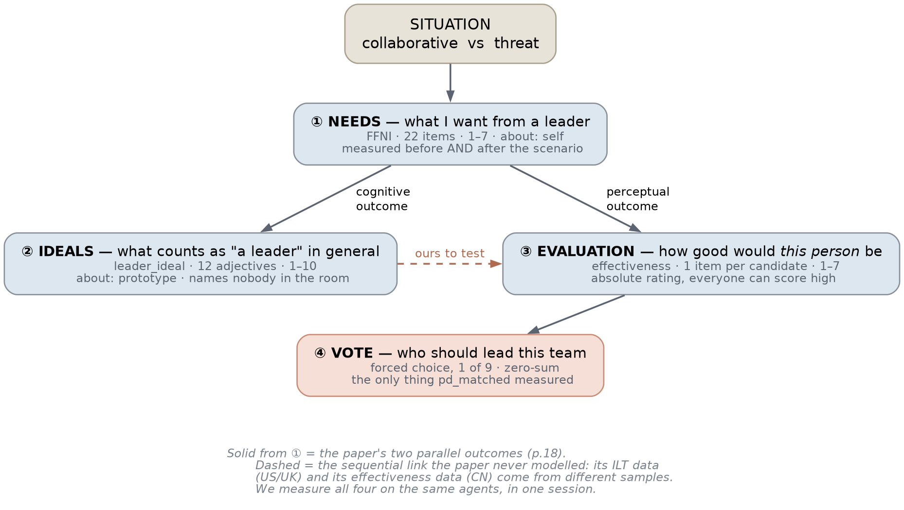
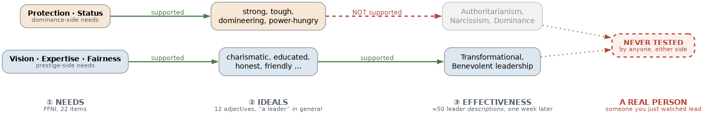
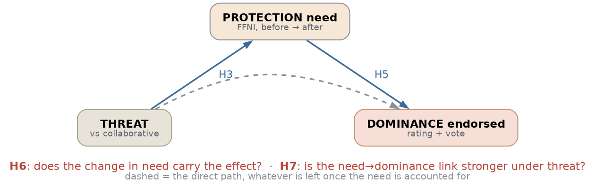
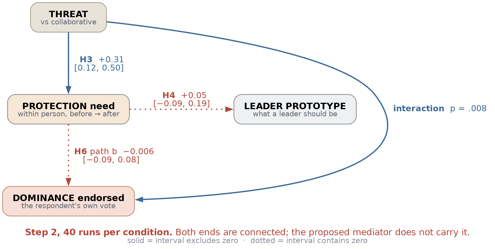

% Follower Needs as a Mechanism: Step 2 Ran
% agent-sim / ffni_mediation
% Weekly report, 2026-08-26

# Where we were, in one slide

- Two kinds of leader: **Prestige** (earned) and **Dominance** (claimed)
- Known effect: threat pushes people toward dominant leaders
- Step 1 reproduced that effect in simulated meetings
- But it could not say *why* — no mechanism was measured
- Step 2 exists to open that box

::: notes

**先把背景講完，這頁講完就有共同語言了**

演化心理學有個「雙路徑模型」：人取得領導地位有兩條路。

- **Prestige（聲望型）**：別人自願把影響力給你，因為你有真本事、願意分享。
- **Dominance（支配型）**：你主動奪取影響力，靠掌控議程、讓反對你的人付出代價。

這不是「好領導 vs 壞領導」，是兩種在不同環境各有優勢的策略。

**已知的效果**：當環境有威脅（經濟不確定、群體衝突），人會轉而偏好支配型領袖。這件事有很強的證據，Kakkar & Sivanathan (2017) 用 69 國、14 萬人的資料證實過。

**我們的模擬**：讓一群 LLM 扮演的角色開會討論一個情境，然後投票選領導者。房間裡有一個聲望型、一個支配型、三個中立者。我們操弄情境（協作 vs 威脅），看投票怎麼變。

**Step 1 做完了什麼**：證明這個模擬環境裡，威脅確實讓支配型勝出，而且不是人格或職業造成的假象。

**Step 1 做不到什麼**：它只有「情境」和「投票」兩端的資料，中間完全是黑箱。任何「為什麼」的問題它原理上都答不出來。

:::

# The question Step 2 asks

- Why does threat shift the vote?
- Candidate answer: it changes what followers *need*
- Threat → "I need protection" → dominant leader looks right
- That chain is assumed everywhere and tested nowhere
- Step 2 measures every link in it

::: notes

**這頁是整個 Step 2 的核心問題**

「威脅讓人偏好支配型」是已知的。但**為什麼**？

最流行的解釋是：威脅改變了追隨者**想從領導者身上得到什麼**。具體來說，威脅讓人更需要「被保護」，而支配型的人看起來比較能提供保護，所以票就轉過去了。

這個解釋聽起來很合理，而且被很多論文當成理所當然。但**從來沒有人真的去測**。

原因很實際：以前沒有一份經過驗證的量表可以測「追隨者的需求」。你沒辦法測量的東西，就沒辦法檢驗它是不是中介變項。

**去年有人把那份量表做出來了**，這就是下一頁。

:::

# The paper this study is built on

- Sheng, Andrews & van Vugt (2026), *J. Applied Psychology*
- FFNI: 22 items, six follower needs
- Protection, Affiliation, Status, Vision, Expertise, Fairness
- Validated across five studies, thousands of participants
- They say plainly: the mediation has never been tested

::: notes

**這篇論文做了什麼**

Sheng, X., Andrews, W., & van Vugt, M. (2026). The psychology of following: Conceptualizing and validating the Fundamental Follower Needs Inventory. *Journal of Applied Psychology*, 111(6), 768–801.

它開發了一份 22 題的量表（FFNI），把「追隨者想從領導者身上得到什麼」拆成六個維度：

- **Protection（保護）**：我要一個擋在我和外部威脅之間的人
- **Affiliation（歸屬）**：我要一個讓大家有凝聚力的人
- **Status（地位）**：我要一個能提升我／我們群體地位的人
- **Vision（願景）**：我要一個能指出方向的人
- **Expertise（專業）**：我要一個真的懂的人
- **Fairness（公平）**：我要一個公正的人

前三個偏「支配側」，後三個偏「聲望側」。

**關鍵的一句話**（論文 p.45-46）：先前研究顯示群體衝突會提升對支配型領袖的偏好，但這些研究「**假設了追隨者需求的中介角色，卻沒有實證檢驗它——很可能是因為缺乏經過驗證的測量工具**」。

我們的研究就是去做那件他們說沒人做過的事。而且我們有一個他們沒有的條件：**我們可以操弄情境**。他們的五個研究全部是問卷和相關研究，只能觀察，不能操弄。

:::

# The chain we are testing

- Situation (threat vs collaborative) — we control this
- Follower need (protection) — we measure this, before and after
- Leader prototype — what "a leader" should be like
- Evaluation — how good is *this specific person* as a leader
- The vote — who you actually endorse

::: notes

**這頁是設計的骨架，後面所有東西都掛在這條鏈上**

我們把「情境 → 投票」中間的黑箱拆成三個可測的層次：

1. **需求（Need）**：我想從領導者身上得到什麼。問的是我自己，不指名任何人。
2. **原型（Prototype）**：「領導者」這個**類別**該長什麼樣。問的是抽象概念，明確說不要想房間裡的任何人。
3. **評價（Evaluation）**：**這個具體的人**當我的領導者會多有效。問的是剛剛一起開會的某個人。

為什麼要分這麼細？因為**這三層可以不一致**，而那個不一致正是論文自己的結果裡出現的東西——下一頁。

最後是**投票**：從房間裡選一個人。這跟評價不同，評價是絕對的（每個人都可以評高分），投票是零和的（只能選一個）。

:::

# The layers do not have to agree

- Their Study 5: protection predicts dominant **prototypes**
- Same study: protection does **not** predict dominant **effectiveness**
- Wanting protection ≠ judging an authoritarian boss effective
- Classification and evaluation are different mental operations
- We measure both layers on the same agents

::: notes

**這頁講的是論文自己結果裡的一個裂縫，也是這個研究最有意思的切入點**

論文的 Study 5 發現兩件看起來矛盾的事：

- 「保護」需求高的人，**確實**會把「領導者」這個概念想像成強壯、威權、陽剛的樣子（原型層成立）
- 但「保護」需求高的人，**並不會**覺得支配型的領導方式比較有效（評價層不成立）

換句話說：**想要被保護，跟認為威權老闆有用，是兩回事。**

這其實很合理。「什麼算是領導者」是一種分類、一種聯想；「這個人當我老闆好不好」是實質判斷。兩者可以分離。

**這對我們的意義**：我們的 H5 預期支配側會是 null——也就是「protection 預測不到有效性」。**這個 null 是預期的結果，不是失敗。** 這點後面會反覆出現，很重要。

**還有一個論文做不到的事**：他們的原型資料在美國和英國樣本，有效性資料在中國樣本，**沒有任何一個樣本同時有兩者**。所以他們無法檢驗這兩層之間的關係。我們可以，因為我們在同一批 agent、同一場會議裡測了全部四層。

:::

# The seven hypotheses, in plain language

- H1/H2 — the vote shifts with the situation
- H3 — threat raises the protection need
- H4 — the need predicts the leader prototype
- H5 — the need predicts effectiveness (dominance side: expected null)
- H6 — the need *carries* the situation onto the vote
- H7 — threat strengthens the whole thing

::: notes

**七個假設，用白話講一遍**

- **H1**：協作情境下，聲望型得票多於支配型。
- **H2**：威脅情境下，支配型得票多於聲望型。
- **H3**：威脅會**提高**保護需求。注意這裡測的是「同一個人在討論前後的變化」，不是「誰的需求比較高」。
- **H4**：保護需求高的人，會把「領導者」想像成強壯的樣子。**這是論文已經證實的結果**，我們拿它當「正對照」——如果連這條都做不出來，代表我們的測量有問題。
- **H5**：需求預測對某個具體的人的有效性評分。聲望側預期成立，**支配側預期不成立**（論文如此）。
- **H6**：保護需求是「情境 → 投票」的**中介變項**。這是整個研究的主角，也是論文說「從沒人測過」的那一條。
- **H7**：威脅會強化上面這些連結。

**什麼是「中介」？** 假設 A 會影響 C。中介的意思是：A 其實是先影響了 B，再由 B 去影響 C。要證明中介，你得同時證明「A 影響 B」和「B 影響 C」，然後把兩者相乘。

以我們的例子：威脅（A）提高保護需求（B），保護需求提高對支配型的支持（C）。

:::

# How to read a result

- p-value: how surprising this data would be if nothing were going on
- Below .05 by convention = "unlikely to be a fluke"
- Confidence interval: the range the true value plausibly sits in
- An interval that excludes zero = there is an effect
- An interval that contains zero = we cannot tell

::: notes

**這頁是給不熟統計的人的，後面的數字都靠它**

**p 值**：假設「其實什麼效果都沒有」，那我們看到這筆資料的機率有多低。p = 0.03 的意思是「如果真的沒效果，只有 3% 的機會會看到這麼極端的資料」。慣例上 p < 0.05 就說「應該不是巧合」。

**信賴區間（Confidence Interval, CI）**：比 p 值更有用的東西。它給的是一個**範圍**，說「真正的數值大概落在這裡面」。

舉例：如果我們估計某個效果是 0.31，95% 信賴區間是 [0.12, 0.50]，意思是真值大概在 0.12 到 0.50 之間。

**怎麼判讀**：

- 區間**不包含 0** → 有效果。像 [0.12, 0.50]，整段都在 0 以上。
- 區間**包含 0** → 看不出來。像 [−0.14, 0.13]，可能是正的、可能是負的、可能是零。

**為什麼區間比 p 值好用**：它同時告訴你「有沒有效果」和「效果多大」。[0.01, 0.02] 和 [0.5, 2.0] 都可以是「顯著」，但意義天差地遠。

後面所有結果我都會給區間。

:::

# Why a null can be the finding

- "We found nothing" usually means "we did not look hard enough"
- Unless you can show you *would* have seen it
- A narrow interval around zero rules out a real effect
- A wide interval around zero rules out nothing
- H5's null is predicted; H6's null had to earn its narrowness

::: notes

**這頁解釋一個容易被誤解的東西**

一般來說「沒發現效果」是最弱的結果，因為它有兩種可能：

1. 真的沒有效果
2. 有效果，但你的研究太小、太吵，看不到

**要怎麼區分？看區間有多窄。**

- 如果區間是 [−0.02, 0.02]，那真值幾乎不可能大於 0.02。你可以理直氣壯地說「就算有效果，也小到沒有實質意義」。
- 如果區間是 [−2.0, 2.0]，那什麼都不能說。真值可能是 +1.8，你只是沒看到。

**這對我們特別重要**，因為有兩個假設的預期結果就是 null：

- **H5 支配側**：論文自己就是 null，我們如果也是 null，那是**複製成功**。
- **H6**：如果它是 null，那就是「論文假設的中介不成立」——一個實質的發現，但前提是我們的區間要夠窄。

所以這個研究從一開始就必須把「檢定力」處理好，這是下一個概念。

:::

# What a power simulation does

- Power: the chance of finding an effect that is really there
- You cannot measure it — you simulate it
- Invent fake data with a known effect built in
- Run the real analysis on it, see how often it finds the effect
- Repeat 100 times, count the hits

::: notes

**什麼是檢定力（statistical power）**

檢定力 = 「假如效果真的存在，我的研究有多少機率抓得到它」。

檢定力 80% 是慣例的及格線。檢定力 30% 的研究，就算效果真的存在，也有七成機率會空手而回——那種研究做了等於沒做。

**問題是：檢定力沒辦法直接量。** 它取決於你不知道的東西（真實效果多大）。

**所以用模擬。** 做法是：

1. 我**自己造假資料**，而且我知道我造的時候塞了多大的效果進去
2. 用**真正的分析程式**去跑這批假資料
3. 看它抓不抓得到我塞進去的效果
4. 重複 100 次，數抓到幾次

抓到 85 次 → 檢定力 85%。

**為什麼要用真正的分析程式**，而不是用公式算？因為我們的分析有一堆公式處理不了的東西：資料是分層的（同一場會議的三個人不獨立）、中介是兩個估計相乘、區間是用 bootstrap 算的。直接模擬比套公式誠實。

**本週做的事之一，就是把這件事第一次做出來**——因為在這之前，沒有人算過 H3 到 H7 的檢定力。

:::

# One run of Step 2, call by call

- Baseline questionnaires — before anything happens
- Three rounds of discussion, five agents
- Post questionnaires — three of them, on separate copies
- The vote — last, on the original agents
- 38 API calls per run, 80 runs total

::: notes

**一場模擬實際發生什麼**

房間裡五個人：1 個聲望型、1 個支配型、3 個中立者。量表只有中立者填（他們是「選民」，另外兩個是「候選人」）。

順序是：

1. **前測**：三個中立者各填一次 FFNI（22 題，需求）和領導者原型量表（45 題）。**這時候還沒有討論。**
2. **討論**：三輪，每輪五個人輪流發言（或選擇沉默）。
3. **後測**：再填一次 FFNI、再填一次原型量表、再對每個候選人評有效性。
4. **投票**：每個人選一個領導者。

**一個關鍵設計**：前測和後測都在**複製體**上進行，不是在真正要投票的那個 agent 上。這樣量表就不會污染討論和投票。這件事本週出了大問題，後面有一整頁講。

**規模**：每場 38 次 API 呼叫，兩個情境各 40 場，共 80 場、約 3000 次呼叫、6 個半小時、約 27 美金。

:::

# Bug 1: the questionnaire was writing into the voter

- Design: surveys run on a throwaway copy of each agent
- Reality: the copy silently failed to be made
- Every post-survey wrote into the agent that then voted
- Cause: the copy hit an unpicklable lock and an empty `except`
- Baseline was always safe; Step 1 had no surveys, so was safe

::: notes

**本週最嚴重的發現，而且是在花錢跑正式實驗之前抓到的**

**設計上應該怎樣**：填問卷時，我們複製一份 agent 出來讓它填。這樣「填過問卷」這件事不會留在真正要投票的那個 agent 的記憶裡。因為一份 22 題、問你「你想從領導者身上得到什麼」的量表，本身就是一個強烈的暗示——填完再去投票，投票就被污染了。

**實際上發生什麼**：討論結束後，程式沒有把「會議室」這個物件從 agent 身上拆掉。而那個物件裡有一個作業系統層級的鎖，是**無法被複製**的。於是複製失敗、拋出錯誤，而程式裡有一行：

    except Exception:
        return person       # 複製失敗就回傳原本那個

於是每一份後測問卷都**直接寫進了正要投票的那個 agent**。而投票就在問卷後面。

**怎麼抓到的**：討論的時候被問「你覺得填量表的記憶會不會干擾到 vote」。我原本回答「不會，程式有做複製」——然後去驗證，發現複製從來沒成功過。

**影響範圍**：前測不受影響（那時還沒有會議室）。Step 1 沒有任何量表，所以資料乾淨。真正會中的是 Step 2，而 Step 2 還沒開始跑。

**修法**：複製前先把會議室拆掉，複製後還原；並且**拿掉那個吞掉錯誤的 except**——複製失敗現在會直接報錯停下，而不是安靜地變成一筆污染的資料。

:::

# Bug 2: the same person seated twice

- Neutral pool of 8, three drawn per run
- On run 3 the pool ran dry mid-draw and reshuffled
- The new shuffle could return someone already in the room
- The simulation crashed with a duplicate-name error
- Would have died on run 3 of the real study, every time

::: notes

**第二個 bug，用便宜模型測試時抓到的**

中立者有 8 個，每場抽 3 個。抽法是「洗牌後依序發，發完再洗」，這樣可以保證每個人出場次數平均。

問題出在**一次抽取的中途剛好發完**：

- 第 1 場抽 3 個（剩 5）
- 第 2 場抽 3 個（剩 2）
- 第 3 場只剩 2 個 → 重洗全部 8 個 → 第 3 個可能抽到前面已經抽過的

結果同一場出現兩個 N5，模擬環境拒絕重複的名字，整個程式當掉。

**為什麼重要**：這個設計（每場抽 3 個中立者）是這週稍早才改的，所以從來沒跑過。如果直接用正式模型開跑，會在**第 3 場**掛掉，前兩場的錢照付。

用便宜模型先測這一步，光這一個 bug 就回本了。

**修法**：跨越邊界時如果抽到已經在場上的人，把他放回新循環的後面，換下一個。

:::

# The estimator was answering the wrong question

- The six needs correlate .60–.72 with each other
- So *every* need correlates with *every* prototype dimension
- Their Table 13: all six predict "Strength" at p < .001
- Only the increment over the other five picks out protection
- Our code computed the wrong column

::: notes

**這頁是本週在統計方法上最重要的修正**

論文的 Table 13 對每個原型維度同時報了兩欄，而它們講完全不同的故事。以 **Strength（強壯）** 為例，那是 protection 唯一對應的維度：

（左邊是單獨看的相關，右邊是控制其他五個需求之後還剩多少）

- **protection**：單獨 .38\*\*\* → 控制後 **.03\*\***
- affiliation：單獨 .29\*\*\* → 控制後 .00
- status：單獨 .29\*\*\* → 控制後 .01
- vision：單獨 .32\*\*\* → 控制後 .00
- expertise：單獨 .26\*\*\* → 控制後 .00
- fairness：單獨 .26\*\*\* → 控制後 .00

**六個需求單獨看全部都顯著。** 只有「控制其他五個之後還剩多少」能把 protection 分離出來。

**為什麼會這樣**：六個需求彼此高度相關（.60 到 .72）。一個「什麼都想要」的人，六個分數都會高。所以任何一個需求單獨拿去跟任何東西算相關，都會顯著。

**我們的程式算的是左邊那欄。** 也就是說 H4 用原本的算法，會「支持」每一個需求對每一個維度——它不可能失敗，而**不可能失敗的檢定不是檢定**。

**修法**：改成六個需求一起做迴歸，看每個需求「額外」貢獻多少。同一個問題也存在於 H5 和 H7，一併修掉。

:::

# Eight people cannot identify six predictors

- H4/H5 regress a person's six needs on their ratings
- A need level is mostly a property of the persona
- 8 distinct neutrals = 8 distinct patterns, however many runs
- The paper fitted the same model on 261 independent people
- Widened the pool to 24 — free, since personas come from a bank

::: notes

**這頁講一個容易忽略的問題：資料筆數不等於資訊量**

H4 和 H5 是拿「一個人的六個需求分數」去預測「他的評分」。跑 40 場、每場 3 個人，看起來有 120 筆資料。

但**中立者只有 8 個不同的人**。一個人的需求分數主要是他的人設決定的，所以那 120 筆資料其實只有 **8 種不同的需求側寫**，每種重複 15 次。

用 6 個預測變項去配 8 種相異的組合，模型幾乎是飽和的——看起來 n 很大，實際上識別不出東西。論文那邊是 261 個獨立的人。

**修法**：把中立者從 8 個擴到 24 個。

**成本是零**：persona 是從一個 3,645 筆的人格資料庫裡決定性地組出來的，不需要呼叫 API。

**但有個陷阱**：原本的程式在分配名字時，會因為「要幾個中立者」的數量改變而重新洗牌，導致**所有人的名字都變**，包括聲望型和支配型。修成「已經存在的 persona 保留原名，只有新的才抽新名字」，變成真正的增量式擴充。

:::

# Four hypotheses had no verdict

- H3 and H7 are claims about the *difference between* conditions
- The report renders one condition at a time
- So neither comparison was computed anywhere
- H4 and H5 printed a number with no interval
- Added `run.py layers`: all four, with intervals

::: notes

**這頁是一個結構性的漏洞，而且很難自己發現**

七個假設裡：

- **H1、H2** 有檢定（t 檢定）
- **H6** 有檢定（bootstrap 區間）
- **H3、H4、H5、H7** ——什麼都沒有

而且 H3 和 H7 講的是「威脅**相對於**協作」，是跨條件的比較。但報表程式一次只處理一個條件，兩份報表之間沒有任何東西把它們接起來。**那個比較在整個程式裡不存在。**

H4 和 H5 則是印出一個係數，沒有區間。前面講過：沒有區間的 null 是不能解讀的，而 H5 的 null 正是預期結果。

**修法**：新增一個指令，一次讀兩個條件的資料，把四個假設全部算出來並附上區間。

**一個技術細節**：算區間用 bootstrap（重複抽樣估計不確定性）。原本的做法是「重抽受試者」，但同一場會議的三個中立者看的是同一段討論，不是獨立的。改成**重抽場次**，這樣區間才誠實。

:::

# Measuring the prototype before, not just after

- The prototype was only measured after the discussion
- So H4 correlated two things measured minutes apart
- That is the correlational design the paper is limited to
- A baseline copy costs no transcript — the cheapest call we have
- Now H4 can ask: did the *change* in need go with the *change* in prototype

::: notes

**這頁是一個「花小錢買大東西」的改動**

原本領導者原型量表只在討論**之後**測。所以 H4 是拿「討論後的需求」跟「討論後的原型」算相關——兩個在同一時間點、同一個人身上測的東西。

這正是論文受限的那種橫斷面相關設計。而**我們的優勢就是可以操弄情境**，結果在這一層完全沒用上。

**改法**：討論之前也測一次原型。

**為什麼便宜**：前測是在討論發生前跑的，agent 手上沒有逐字稿，所以那次 API 呼叫不用帶任何上下文——是整個設計裡最便宜的呼叫。每場多 3 次。

**買到什麼**：H4 現在有兩種讀法。

- **水準值**：需求高的人原型也高（這是論文的問法，複製）
- **變化量**：需求**變化**大的人，原型**變化**也大（這是論文的資料問不出來的，延伸）

第二種才是因果鏈的形狀，也是中介的邏輯。

:::

# Is the questionnaire usable at all?

- Before spending on 80 runs, check the instruments
- Administer each scale twice, with nothing in between
- Four gates: differentiation, straight-lining, consistency, stability
- Costs a couple of dollars; discovering it 40 runs in does not
- The 45-item prototype scale failed

::: notes

**什麼是 measure-check**

在花錢跑正式實驗之前，先確認量表在這些 agent 身上真的能用。做法是：讓每個 persona 填同一份量表**兩次**，中間什麼都不發生，然後看四件事：

1. **分量表有沒有差異**——如果六個需求分數都一樣，量表沒在區分東西
2. **有沒有人整份填同一個數字**（straight-lining）——那代表 agent 放棄作答了
3. **內部一致性**——同一個分量表的題目彼此該相關（alpha 係數）
4. **重測穩定性**——同一個人兩次填的答案該對得上

**第四項最關鍵，而且需要解釋。**

:::

# Test-retest, and the noise floor

- Ask the same person twice with nothing in between
- Their two answers should agree — that is test-retest
- The gap between them is the **noise floor**
- Any change the study blames on its scenario must beat that floor
- Protection's floor started at 1.01 on a 7-point scale

::: notes

**這兩個概念後面一直會用到**

**重測信度（test-retest）**：同一個人、同一份量表、中間什麼都沒發生，兩次答案有多一致。用相關係數表示，0 到 1。

- 接近 1：非常穩定
- 接近 0：完全對不上，等於在測雜訊

**雜訊地板（noise floor）**：兩次答案的**差距**有多大。

這個數字為什麼重要？因為我們的 H3 和 H6 測的是「討論前後的變化」。如果同一個人在什麼都沒發生的情況下，分數就會晃 1.01 分，那麼一個由情境造成的 0.3 分變化就完全埋在雜訊裡——**你分不出那是情境造成的還是量表自己在抖。**

所以雜訊地板直接決定了這個研究能不能看到它要看的東西。

:::

# The scale failed, then passed

- First run: the 45-item prototype scale failed
- Not "too stable" — the agents could not reproduce their own answers
- Internal consistency was fine; repeatability was not
- Dropping the sampling temperature to 0 fixed a third of it
- Protection barely moved: floor stayed at 1.01

::: notes

**第一次跑 measure-check 的結果**

- **FFNI（需求量表）**：通過
- **領導者原型量表（45 題）**：**不通過**，平均重測信度 0.35，門檻是 0.40

失敗的方向跟預期相反。我們原本擔心的是「agent 太固執，情境推不動」，實際上是「agent **重現不了自己的答案**」。

而且內部一致性很好（alpha 0.73 到 0.99），沒有人亂填 45 題。也就是說：**單次作答內部連貫，兩次之間對不上。**

**第一個嘗試：把 temperature 調成 0。**

temperature 是控制模型輸出隨機性的參數。0 代表「每次都選機率最高的字」，也就是盡可能決定性。

結果：原型量表從 0.35 升到 0.47，通過了。最差的幾個分量表接近翻倍。

**但 protection 幾乎沒動**（0.21 → 0.26），雜訊地板還是 1.01。而 protection 正是 H6 的中介變項、H4 支配側的起點。

:::

# The real culprit was item order

- Items were re-shuffled on *every* administration
- So the same persona met a different order before and after
- Order sensitivity landed straight in the before-after difference
- Fixed the order per person instead of per administration
- Protection's floor: 1.01 → **0.40**. Retest: .26 → **.83**

::: notes

**這是本週對統計效力影響最大的單一改動，而它來自討論中的一個問題**

程式在每次施測時都會把題目順序重新隨機一次。這個設計本身有道理：題目隨機呈現可以避免位置偏誤，而且 FFNI 原本就是這樣驗證的。

**但它有個副作用**：同一個人在前測和後測拿到的是**不同的題目順序**。於是「前後差異」裡面混進了「換個順序就答不一樣」的成分。

而前後差異正是 H3 的依變項、H6 的中介變項。

**修法不是拿掉隨機，是改變隨機的層級**：

- 原本：每次施測重洗 → 同一人的前後測順序不同
- 改成：依 persona 決定順序 → 同一人前後測順序相同，人與人之間仍然不同

「題目隨機呈現」仍然成立，跨受試者的位置偏誤照樣被打散，但人內的前後差不再被重新排序污染。

**效果**：

- protection 雜訊地板：1.01 → **0.40**
- protection 重測信度：.26 → **.83**
- strength 重測信度：.46 → **.81**

**所有量表的雜訊地板大約減半。**

**一個附帶結果**：修完之後，「兩次施測」變成幾乎相同的 prompt，重測信度衝到 0.89。原本的閘門有一個上限（0.85，用來抓「agent 太固執」），現在會把一份變好的量表判為不合格。因為那個上限的前提（兩次施測是有意義的兩個獨立場合）已經不成立，所以拿掉了上限，保留下限。

:::

# How many runs do we need

- Built a power simulation for H3 through H7 — never done before
- Feeds fake data with a known effect through the real analysis
- 40 runs per condition: H3 100%, H4 94%, H6 31–95%
- 20 runs: H5's false-positive rate is 13%, not 5%
- 60 runs buys nothing: H6 is a cliff, not a slope

::: notes

**本週第一次算出層次假設的檢定力**

在這之前，「40 場夠不夠」這個問題只針對**投票**算過。H3 到 H7 是完全不同的估計，資料結構也不同，從來沒人算過。

**結果**（每條件 40 場）：

- H3 情境推動需求：**100%**
- H4 需求變化 → 原型變化：**94%**
- H5 偽陽性率：**2%**（20 場時是 13%）
- H6 間接效果：**31%**（小效果）～ **95%**（中效果）

**最重要的一行是 H5 那行，而且它跟檢定力無關。**

H5 的支配側**預期是 null**。20 場的時候，這個檢定會在「其實沒效果」的情況下有 **13%** 的機率誤報有效果——名目上應該是 5%。也就是說 20 場跑出來的 null 根本不可信。40 場才回到正常。

**所以 40 場是下限，理由是偽陽性率，不是檢定力。**

**60 場買不到東西**：H6 在小效果時 40 場 31%、60 場 44%（都不夠）；中效果時 40 場已經 95%（不需要加）。多花 50% 的預算在兩端都沒有回報。

:::

# Step 2 ran: the behavioural result

- 40 runs per condition, 6.5 hours, about $27
- H1 (collaborative: Prestige wins): **supported**, p = .017
- H2 (threat: Dominance wins): p = .105, not supported alone
- **Interaction: supported, p = .0076**
- The behavioural effect replicates

::: notes

**正式實驗的第一部分結果：投票**

- H1 協作情境，聲望型勝：**成立**，p = .017（1.65 票 vs 0.90 票）
- H2 威脅情境，支配型勝：p = .105，單獨不成立（1.57 vs 1.10）
- **交互作用：成立，p = .0076**

**什麼是交互作用**：不是問「威脅情境下支配型有沒有贏」，而是問「**威脅情境的支配型優勢，有沒有比協作情境更大**」。

這才是真正對應「威脅造成轉變」這個理論宣稱的檢定。兩個條件各自顯著，並不等於兩者之間有差異。

而且檢定力模擬早就顯示，交互作用比單一條件更有力——因為協作情境往反方向錨定，把要檢定的差距拉開了。所以 H2 單獨落在 .105 是預期內的，不是失敗。

**結論：行為效果複製了。** 而且是在所有修正都生效的情況下——沒有操縱檢核的暗示、選民限縮到中立者、配對抽樣修好、persona 不再帶有「你是支配型」的標籤。

:::

# Step 2 ran: the mechanism result

- H3: threat raised protection, **+0.31, CI [0.12, 0.50]**
- And only protection — every other need's interval contains zero
- H4: null. H5 dominance side: null (as the paper found)
- H6: path a = 0.31, path b = **−0.006**
- Indirect effect: −0.002, CI [−0.027, 0.024]

::: notes

**正式實驗的第二部分結果：機制**

**H3 成立，而且只有 protection。** 威脅讓保護需求相對上升 0.31 分，區間 [0.12, 0.50]，不含 0。其他五個需求的區間全部含 0，包括 status。

**威脅推動的正是論文預測的那一個需求，而且只有那一個。** 這是很乾淨的結果。

**H6 沒有中介：**

    path a   情境 → 保護需求      = 0.310    ✓ 威脅確實推高了需求
    path b   保護需求 → 那一票    = -0.006   ✗ 但需求完全預測不到投票
    間接效果 = a × b              = -0.002   區間 [-0.027, 0.024]

**path a 成立，path b 是零。** 鏈條斷在中間。

用白話講：**威脅確實讓這些 agent 更想要被保護，威脅也確實讓他們更常投給支配型的人，但「更想要被保護」的那些人並不是投給支配型的那些人。**

兩端有因果連結，但提出的中介變項不承載那個連結。

:::

# What the null does and does not rule out

- The interval is narrow in absolute terms
- Dividing by path a puts path b inside roughly [−.09, .08]
- That excludes a **medium** mediation — the simulation's medium case lands at +.14
- It does **not** exclude a small one: the small case lands at +.02, inside
- So: we looked, and can rule out a medium effect but not a small one

::: notes

**這頁解釋這個 null 的內容有多少——以及它的上限**

前面講過，null 只有在區間夠窄的時候才有內容。間接效果的區間是 [−0.027, 0.024]，用 path a = 0.31 除回去，path b 的區間大約是 **[−0.09, 0.08]**。

**先前的版本說這排除了「小效果」。那是錯的，2026-09-07 更正。**

原因是模擬裡的 `b_vote` 乘的是**真實**的需求變化，而估計式迴歸的是**觀測**的需求變化——中間隔著量表的雜訊。用模擬器自己的產生器實測：

- `b_vote = 0.10`（小效果）→ 估計式實際看到 **+0.023**，**落在區間內**
- `b_vote = 0.25`（中效果）→ 估計式實際看到 **+0.142**，落在區間外

還有第二層：把間接效果除以 path a 是**把 a 當成已知**，但 a 自己的區間是 [0.125, 0.496]，取下界的話連中效果都框不住。

**所以正確的說法是：能排除中等強度的中介，不能排除微小的中介。**

這仍然比「沒看到」強——中效果若存在，在這個樣本數下有 95% 會被抓到——但遠不到「排除除極小效果之外的一切」。

Sheng 等人明說這個中介「被假設但從未被實證檢驗」。現在檢驗了，而且是在情境被操弄、需求人內前後測、結果是行為的條件下。**中等強度的版本不成立。**

……而這句話能推到多遠，下一頁還要再打折扣。

:::

# But the positive control failed

- H4 is not our hypothesis — it is **their published positive result**
- It was built in as the study's positive control
- Baseline-only test (their conditions): expertise and vision replicate
- Protection looked **reversed** at −0.16 — but that was the wrong scale
- The paper's own instrument puts `bold` in Charisma, not Strength
- Rescored its way, protection → Strength is a **null**, not a reversal

::: notes

**這頁是本週最重要的一個修正，而且是被問出來的**

**什麼是正對照（positive control）**：在實驗裡放一個「已知答案」的檢定。如果連它都做不出來，代表你的測量有問題，其他結果也不能信。

H4 就是這個角色。它**不是我們發明的假設**，是論文 Study 5 已經證實的結果：保護需求高的人，會把領導者想像成強壯的樣子。

而我們的 H4 是 null。

**進一步的診斷**：論文是在「冷測」條件下測的——沒有討論、單次施測、用水準值。而我們的 H4 用的是討論**之後**的分數。既然這週剛加了前測，最接近論文條件的分析其實就躺在同一批資料裡，只是沒人算過。

**2026-09-07 補充：這一頁的結論後來被推翻了一半。** 拿到 Offermann & Coats (2018) 原文後發現，`bold` 在論文實際使用的量表裡屬於 **Charisma**，不屬於 Strength。而我們的重建把它放在 Strength，且整個「反向」都由它承載。用論文的歸屬重新計分：protection → Strength 從 −0.16（顯著反向）變成 **−0.067，CI [−0.214, +0.077]——含 0，是 null 不是反向**。

所以正對照仍然沒複製成功（null），但「做成反方向」那句話是計分錯誤造成的。下面的數字保留為當時的記錄。

算出來（前測對前測，80 場、240 人、重抽場次的區間）：

（論文對這五個需求全部預測正向）

- expertise：**+0.23**，CI [0.12, 0.34] — **複製**
- vision：**+0.13**，CI [0.03, 0.23] — **複製**
- status：−0.03，CI [−0.14, 0.10] — null
- **protection：−0.16，CI [−0.29, −0.01] — 顯著反向**
- fairness：−0.20，CI [−0.31, −0.11] — 顯著反向

**五條裡三條的區間排除 0，所以這不是量表在吐雜訊。** 是一個有結構的失敗：

**聲望側的需求重現了論文的個體差異結構，支配側的沒有。** 而整個研究問的就是支配側。

:::

# What we can and cannot claim

- The behavioural effect: solid, replicated twice
- H3 (threat raises protection): solid
- H6's null, **about this simulation**: solid, narrow interval
- H6's null, **about people**: much weaker than it looks
- Agents that reproduce a known association backwards are thin evidence

::: notes

**這頁是誠實的結論**

**可以講的：**

1. **行為效果紮實。** 交互作用在 n=10 的校準和 n=40 的正式實驗各複製一次。
2. **H3 紮實。** 威脅確實推高保護需求，而且只推高保護需求。
3. **H6 的 null 對「這個模擬」成立。** 區間窄，能排除小效果以外的一切。

**不能講的：**

**H6 的 null 對「人類」的推論力大幅減弱。** 因為同一批 agent 連論文已確立的「保護需求 → 強壯原型」關聯都做不出來，還做成**反向**的。一群重現不出已知關聯的受試者，在一個從未被檢驗的關聯上回報 null，對真實人類的證據力很有限。

**最可能的解釋，依權重排序：**

1. **這些是 LLM persona，不是人。** persona 的「需求」和「領導者原型」都是從同一份人格描述生成的，兩者之間的相關結構是模型自己的一致性邏輯，沒有理由重現人類的個體差異結構。
2. **重建的量表不是論文用的那份。** 我們用 1994 年的版本重建，論文用 2018 年的修訂版，而且 strength 只有 2 題。
3. **天花板效應。** strength 的平均是 7.39（滿分 10），大家都同意領導者該強，剩下的變異很小。

**一個會延續到下個研究的教訓**：模擬族群可以重現**行為效果**，卻重現不出機制宣稱所需的**共變結構**。這是兩件要分開驗證的事，而這個設計驗證了前者、假設了後者。

:::

# This week

- Found and fixed a data-contamination bug before it cost anything
- Two more silent bugs: duplicate casting, wrong statistical column
- Gave four hypotheses a verdict they never had
- Halved every noise floor by fixing item order
- Ran Step 2: effect replicates, mediator does not carry it

::: notes

**本週成果總結**

**一、修掉三個會靜默破壞資料的 bug**

1. **問卷寫進投票者的記憶**——複製從來沒成功過，被一行 `except` 吞掉。Step 2 全中，但在開跑前抓到。
2. **同一場抽到同一個人兩次**——正式跑會在第 3 場必掛。
3. **統計算錯欄位**——六個需求彼此相關 .60–.72，單獨看每個都顯著。H4 用原本的算法不可能失敗，而不可能失敗的檢定不是檢定。

**二、補上缺失的判準**

H3、H4、H5、H7 四個假設原本沒有任何檢定，而且 H3 和 H7 的跨條件比較在程式裡根本不存在。新增了一個一次算完四個並附區間的指令。

**三、把雜訊地板減半**

題目順序原本每次施測都重洗，導致「換個順序就答不一樣」混進了前後差異。改成依人固定順序後，protection 的雜訊地板從 1.01 掉到 0.40、重測信度從 .26 升到 .83。這是本週對統計效力影響最大的單一改動。

**四、第一次算出層次假設的檢定力**

40 場：H3 100%、H4 94%、H6 視效果大小 31–95%。20 場時 H5 的偽陽性率是 13%，這是「40 場是下限」的真正理由。

**五、跑完 Step 2**

行為效果複製（交互作用 p = .0076）、H3 成立（+0.31）、H6 沒有中介（間接效果區間 [−0.027, 0.024]）。

**六、發現正對照失敗**

H4 是論文的正面結果，我們做成反向的。這限縮了 H6 的 null 能推到多遠。

**一句話的故事線**：本週把 Step 2 從「有一堆靜默錯誤的設計」修成「可以下結論的實驗」，跑完之後得到一個乾淨的行為複製和一個乾淨的機制否證——但同一批資料也顯示，這個模擬重現不出論文已確立的個體差異結構，所以那個否證目前只能講到「在這個模擬裡」。

:::

# Next

- Report the chain segment by segment, not as one product
- H2, H3 and H4-within each carry evidence on their own
- Fix the prototype measure before trusting the dominance side
- More respondents per run beats more runs for the mediation
- Treat a published association as a gate, not an afterthought

::: notes

**下一步**

**一、改變報告的方式**

H6 想用一個係數宣稱整條路徑，那是最貪心的版本。而這條鏈的每一段各自都夠力：

- H2 / 交互作用：情境 → 投票（p = .0076）
- H3：情境 → 保護需求（+0.31）
- H4 人內：需求變化 → 原型變化（檢定力 94%）

逐段建立機制證據，比押在一個乘積上穩健。

**二、支配側的測量要先修**

在相信任何支配側的結論之前，得先讓 H4 的支配側做得出來。可能的方向：換回 2018 年版的原型量表、增加 strength 的題數、或處理天花板效應。

**三、如果要救 H6**

槓桿依效果排序：

1. **每場多幾個中立者**（不是多幾場）——path b 是受試者層次的迴歸，而討論是共用的，加人比加場便宜
2. **後測做兩次取平均**——把中介變項的信度從 .61 拉到 .76
3. 換連續的結果變項——但那就是 H5 的有效性評分，會讓兩個假設壓在同一個係數上，是設計上刻意避開的

**四、方法論上的一般教訓**

任何在 LLM persona 上做機制研究的設計，都應該把「已發表的正向關聯」當成**在解讀未檢驗那條之前必須通過的閘門**，而不是事後才讀的對照。這次是先跑完才發現正對照失敗，順序應該反過來。

:::
